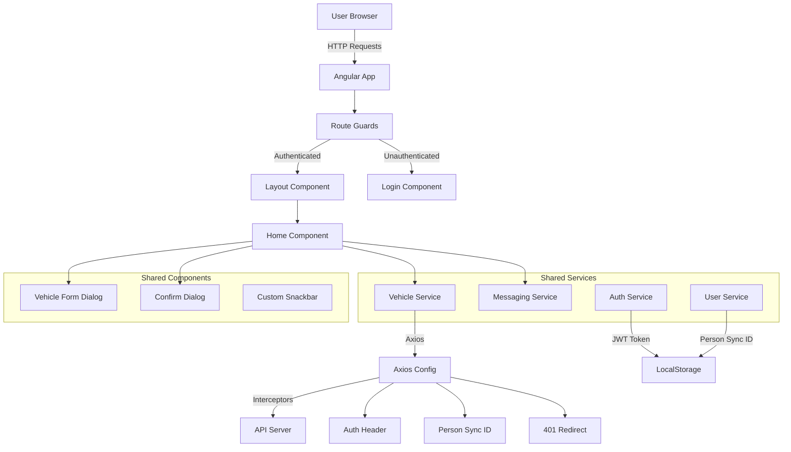

# SupaDupa Angular Base

Angular 20 application for vehicle management with authentication, CRUD operations, and Material Design UI.

## Architecture



## Features

- **Authentication**: JWT-based login with token storage
- **Vehicle Management**: Create, Read, Update, Delete vehicles with pagination and search
- **Material Design**: Modern UI with Angular Material 3
- **Error Handling**: Global error handler with 401 auto-redirect to login
- **Axios Integration**: HTTP client with interceptors for auth headers and error handling

## Prerequisites

- Node.js (v18 or higher)
- npm
- Backend API server running

## Setup

1. **Configure API endpoint**:
   Edit `src/environments/environment.ts` and replace the `CORE_BASEURL` with your actual server base URL:
   ```typescript
   CORE_BASEURL: 'https://your-server-url/api/'
   ```

2. **Install dependencies**:
   ```bash
   npm install
   ```

3. **Start development server**:
   ```bash
   npm start
   ```

4. **Access the application**:
   Open `http://localhost:4200` in your browser

## Account Creation

**Note**: The create account feature is currently not implemented in the application. User accounts must be created through the Swagger API documentation or directly via the backend API. Due to time limit some feature is currently unimplemented like managing state with redux, store token and personSyncId in there instead of localStorage or sessionStorage.

## Project Structure

```
src/app/
├── home/              # Vehicle management page
├── shared/
│   ├── components/   # Reusable components (login, dialogs, snackbar)
│   ├── services/      # Business logic services
│   ├── models/        # TypeScript interfaces
│   ├── interceptors/  # HTTP interceptors (legacy, kept for HttpClient)
│   ├── config/        # Axios configuration
│   └── route-guards/  # Route protection guards
└── store/            # NgRx state management
```

## Tech Stack

- **Angular 20** - Framework
- **Angular Material 3** - UI Components
- **Axios** - HTTP Client
- **RxJS** - Reactive Programming
- **NgRx** - State Management
- **TypeScript** - Language
